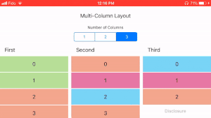

# MultiColumnLayout
[](http://cocoapods.org/pods/MultiColumnLayout)
[](https://swift.org)
[](http://cocoapods.org/pods/MultiColumnLayout)

`MultiColumnLayout` is an implementation of a `UICollectionViewLayout` to support multiple columns, and distribute elements accordingly.

{:height="50%" width="50%"}


## Example

There is currently an Example project that you can have a look at.

## Installation

MultiColumnLayout is available through [CocoaPods](http://cocoapods.org).

To install it with **Cocoapods**, add the following line to your `Podfile`:
```ruby
pod "MultiColumnLayout"
```

## Contributing

Have a suggestion? All contributions are welcome!

## Author

[@ibakurov](https://twitter.com/ibakurov)

## License

MultiColumnLayout is available under the MIT license. See the LICENSE file for more info.
